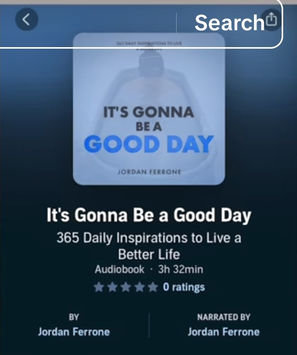

# Project Plan

## Introduction

This document outlines the structured plan for the development of **["Quote of the Day"]** web page.  
The purpose of this plan is to provide a clear roadmap from idea conception to implementation, ensuring that the project is built with clarity, scalability, and user experience in mind.

By documenting the problem, defining the minimum viable product (MVP), and considering both immediate and future requirements, this plan will serve as a guide for development, collaboration, and decision-making throughout the project lifecycle.

---

## 1. Problem Statement

For someone struggling to get up and face the day or one at a very critical low point in life due to personal pressures and as well facing various challenges in Life, a word of encouragement or a motivational quote might speak life back into this individual and might be a turning point for one to get up and put his/her life back together.

At the same time, another going through a very joyful and peaceful season in their life and feels the urge to share the joy and happiness with friends and family, an excellent uplifting quote might assist one attach beautiful text on the moment or motivate his loved ones to keep moving forward and attain victory in life as well.

Therefore this project aims to provide a simple yet powerful platform that delivers inspiring quotes—whether to uplift someone in a difficult moment or to amplify joy and success and inspire others.

---

## 2. Core Features (MVP)

### Must-Have Features

- The application must have a feature that displays the **"Quote of the day"** text and the aurthor clearly and neatly for the user easily and comfortably read the text without straining.
- The application must have a way to easily switch to the next quote or come back to the previous quote because different users have different tastes and preferences.

### Nice-to-Have Features (Future Enhancements)

- An option to download the current quote (e.g., as an image or text file) for personal use or sharing.
- A settings modal where users can set personal preferences e.g changing themes between light/dark mode, changing fonts and much more.
- An ability to display quotes by specific categories (e.g., motivation, happiness, success) or filter by author.
- A search bar to quickly find quotes by keyword or author name.

The MVP ensures that the essential goal—delivering inspiration with minimal friction—is achieved first, while leaving space for richer personalization and interactivity in future iterations.

---

## 3. Data Structure

The quotes will be stored in a simple and flexible data structure that can be easily managed within JavaScript.  
For the MVP, an **array of objects** is the most suitable choice because it:

- Allows us to store multiple quotes in a single collection.
- Provides an intuitive way to represent each quote with its text and author.
- Can be easily extended in the future to include additional properties such as category, tags, or source.
- Works seamlessly with JavaScript methods for random selection, searching, and filtering.

### Example Structure

```javascript
const quotes = [
  {
    id: 1,
    text: "The best way to get started is to quit talking and begin doing.",
    author: "Walt Disney",
    category: "Motivation",
  },
  {
    id: 2,
    text: "In the middle of every difficulty lies opportunity.",
    author: "Albert Einstein",
    category: "Inspiration",
  },
  {
    id: 3,
    text: "Happiness is not something ready-made. It comes from your own actions.",
    author: "Dalai Lama",
    category: "Happiness",
  },
];
```

---

## 4. UI/UX Sketch

The user interface will follow a **clean, minimal, and centered layout** that emphasizes the quote as the primary element.  
The design will ensure readability, accessibility, and responsiveness across desktop and mobile devices.

### Layout Overview


---

## 5. Theming & Styling

The "Quote of the Day" app will adopt a **minimalist and inspirational look and feel**, inspired by modern audiobook and lifestyle app design. The goal is to create a clean interface that puts the quote at the center, while subtle styling reinforces positivity and calmness.

### Visual Inspiration (modern audiobook and lifestyle app design)



- **Color Palette** (inspired by the screenshot):

  - **Primary**: Deep Navy Blue (`#0A1F44`) – background for focus and contrast.
  - **Accent**: Bright Sky Blue (`#4A90E2`) – highlight for quotes or buttons.
  - **Text Colors**:
    - White (`#FFFFFF`) for primary text.
    - Light Gray (`#B0B0B0`) for secondary details (author names, UI hints).

---

## 6. Future Ideas (Scale & Configurability)

While the MVP focuses on delivering a simple, polished experience with random quotes, the application has room to grow into a richer, configurable platform that caters to diverse user needs.

### Application Potential Enhancements

- The download button feature to download the current quote (e.g., as an image or text file) should be working as expected.
- I also vision to migrate this application to mobile where it serves it's best purpose by popping daily notifications to the user and offering them daily random quotes.
