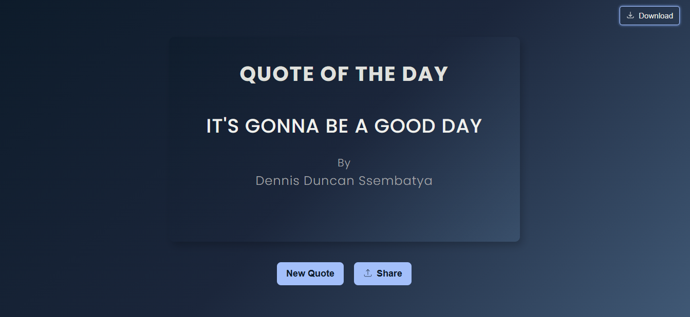

# Project Plan

## Problem Statement

- I was prompted by my supervisor to build a "Quote of the day" web application where the user can read an inspiring quote plus it's author when the page loads and can as well click a button to display a new randomly selected quote.

## Proposed Solution

### Mobile/Desktop Application (nice approach);

- However much this application is best suited on a mobile device or desktop application due to its core functionality of displaying just one random inspiring quote to the user every single day hence its name "Quote of the Day" where features like notification pop-ups, alerts and reminders can best be implemented to make this application more efficient was out of scope basing on the instructions I received for this project as referenced here below

> HTML/CSS:
>
> - Use semantic HTML.
> - Center the layout and use a modern font (e.g., from Google Fonts).
> - Style the button to be interactive with a hover effect.
> - Ensure good spacing, so the design feels clean and uncluttered.
>
> JavaScript:
>
> - No libraries or frameworks. Pure, vanilla JavaScript only.
> - Use the data structure you defined in your plan.
> - Use document.querySelector() to access your HTML elements.
> - Use addEventListener() to handle the button click.
> - Use .textContent to update the quote and author.

- I'm also not very comfortable with React-native or related frameworks like Flutter that could easily be considered to build this project as a mobile/desktop application and this could take me a longer time to close the knowledge gap and get up to speed with the technologies needed to pull off this project in time and yet am already behind schedule therefor still this is not a brilliant approach to go about this project.

### Web Application (best approach);

- A web application is exactly what the supervisor expects this project to be while following the rules and guidelines declared in building the application.
- The web application for this project is intended to focus first on completion & quality rather not on complexity which is actually ideal to build a small, complete, and polished web application as well as mastering fundamentals of how to make a webpage interactive and starting to build the professional habits.
- Although this approach has limited functionality and the user experience is a bit shallow, it fulfills the client needs and later lone with more time allocated to this project, I vision to make this project advanced with advanced features like "changing user settings", "downloading quotes", "sharing quotes on socials", "filtering quotes by category or author" as well as migrating it to Mobile both on Android and IOS.

## Quote of the Day "The Night Bird" (MVP)

### Must Haves (Core Features)

- A feature that displays the "Quote of the day" quote and the author together.
- A component with a click event listener to display a new randomly selected quote when the user fires a click event.

### Good to Haves (Future Enhancement)

- A feature to share the displayed quote on social handles like (Instagram, Twitter, WhatsApp etc.)
- A feature to download the displayed quote as text or image
- A feature that can be triggered to open/close a modal window with "user preferences" like (font-size, font-style, theme etc.) to improve visibility or text readability.

## The Road Map (Implementation)

### UI/UX Sketch

- Previous hand Sketch
  

- Updated UI/UX design
  

- **Changes in the design**: I initially planned to display the "quote_card" component with two buttons in sides (the previous & next button) both with their respective functionality of displaying the next random quote or displaying the previous quote but when I put more thought to it, I realized that is a totally different concept from what this application is targeting to achieve.
- The "Carousel" Component which I initially planned to go with bases on a concept of a set data structure which in our context displays "quotes and their authors" in a sequential order from top to bottom and gives the User a feeling of scrolling to get to the last quote which for this particular project is not what's required, and it removes the ability for a user to view randomly selected quotes as his now just moving back and front in a sequence of quotes.

- **HTML/CSS and JavaScript**: Most of these rules have already been pre-determined by my supervisor and my task is pretty much to work in the constraints set-up for this project.

### Data Structure

- I will store the quotes in a JavaScript array of objects. Each object will represent a single quote and contain its text and author.
- **Example Structure:**

```js
const quotesData = [
  {
    quote: "The only way to do great work is to love what you do.",
    author: "Steve Jobs",
  },
  {
    quote: "Strive not to be a success, but rather to be of value.",
    author: "Albert Einstein",
  },
  {
    quote: "The mind is everything. What you think you become.",
    author: "Buddha",
  },
  // ... more quote objects
];
```

- **JavaScript Code Structure (OOP Approach)**
  I will structure my JavaScript using a Quote Manager Class and a Quote Display Logic section to separate concerns.

1. The Quote Manager Class
   This class will handle all the data management and business logic, such as selecting a random quote.

```js
class QuoteManager {
  constructor(quotes) {
    // Store the array of quote objects
    this.quotes = quotes;
    // Optionally store the last selected index to prevent immediate repetition
    this.lastIndex = -1;
  }

  // Method to get a single random quote object
  getRandomQuote() {}
}
```

2. Initialization and Display Logic
   This section handles the DOM manipulation and the event listeners.

```js
// const quotesData = [...]

// 2. DOM Element Selectors
const quoteTextElement = document.querySelector(".quote-text");
const quoteAuthorElement = document.querySelector(".quote-author");
const newQuoteButton = document.querySelector(".new-quote-btn");

// 3. Instantiate the QuoteManager
const manager = new QuoteManager(quotesData);

// 4. Function to display a quote
function displayNewQuote() {
  const newQuote = manager.getRandomQuote(); // Get the random quote object

  // Update the DOM elements
  quoteTextElement.textContent = newQuote.quote;
  quoteAuthorElement.textContent = `- ${newQuote.author}`;
}

// 5. Event Listeners and Initial Load
newQuoteButton.addEventListener("click", displayNewQuote);

// Initial quote display on page load
displayNewQuote();
```

#### Why the Array of Objects + OOP Class Structure

1. Superior Data Integrity and Cohesion:

Data Integrity: In a parallel array structure (quotes[i] corresponds to authors[i]), you must maintain two arrays perfectly in sync. If you accidentally add a quote but forget the author, your application will break or show the wrong author.

Cohesion: The object {quote: "...", author: "..."} ensures the quote and its author are cohesive—they are inseparable parts of the same entity. This makes adding, removing, or accessing a complete quote entity atomically safe.

2. Cleaner Logic and Separation of Concerns (SoC):

Encapsulation: The QuoteManager class encapsulates all the business logic (random selection, tracking the last quote) and the data (this.quotes). The main application logic only needs to call manager.getRandomQuote().

Testability: Because the data management logic is isolated in a class, it can be tested independently of the HTML/DOM manipulation. This is essential for robust applications.

State Management: The class can easily manage internal state, like tracking this.lastIndex to prevent immediate quote repetition, which is difficult to do cleanly with simple, separate functions that rely on global variables.

1. Simpler Random Selection
   Why Arrays are Better than Nested Objects:

Native Indexing: The primary operation for a "Quote of the Day" app is random selection. Arrays are natively indexed (0,1,2,...), making random selection trivial: Math.floor(Math.random() \* array.length).

Object Iteration Overhead: To randomly select from a nested object (like a map/dictionary), you first have to get an array of all the keys (Object.keys(quotes)), then select a random key, and then access the value. While not difficult, it adds an extra step compared to direct array indexing.
